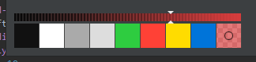

# RGBA ColorPicker
komodo edit/ide

Replaces the default colorpicker with a RGBA compatible ColorPicker

## Screenshot

## Saving Colors
When you want to save a color to the ColorPicker memory colors.
You will have to click on the chosen color and it will be added to the memory colors.
If you added a memory color and click on cancel the memory color will not be saved.

## Copy, paste and cut
Copy paste and cut is added in the 1.1 release.  
You don't need to have a selection for these actions to work.  
If you don't make a selection, it will still copy/paste/cut the whole value.  

Build with the [PitPik ColorPicker](http://www.dematte.at/colorPicker/)
