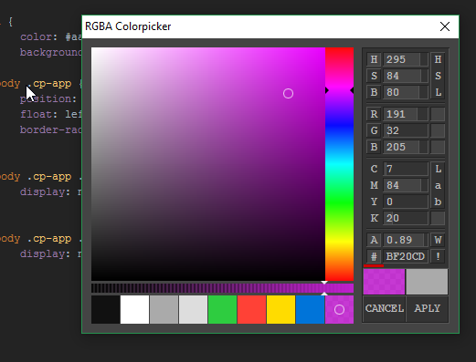

# RGBA Colorpicker
komodo edit/ide

Replaces the default colorpicker with a RGBA compatible Colorpicker

## Screenshot

## Copy, paste and cut
Copy paste and cut is added in the 1.1 release.  
You don't need to have a selection for these actions to work.  
If you don't make a selection, it will still copy/paste/cut the whole value.  

Build with the [PitPik ColorPicker](http://www.dematte.at/colorPicker/)
